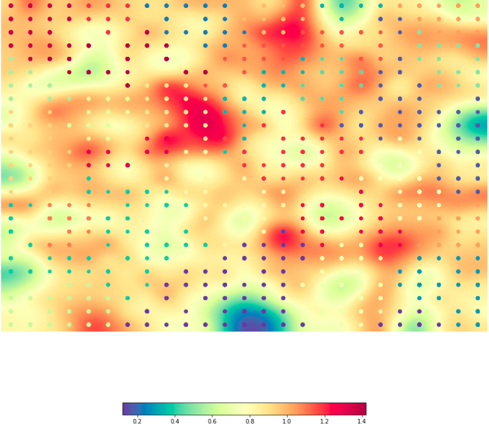

# Unsupervised learning

<p float="center">
  
</p>

## Dataset

We were given a subset of [Carnegie Mellon Movie Summary Corpus](http://www.cs.cmu.edu/~ark/personas/), that contains 42,306 movie plot summaries extracted from Wikipedia and aligned metadata extracted from Freebase, including the movie title, one or more labels about to genre and a short summary. 


## Movie recommendation system based on the content

In the first part, we implement a content based recommendation system for movies. The purpose of this system is to recommend movies that might interest the user, using content-based filtering method. First, we convert each summary in a tf-idf vector representation and, then, we recommend to the user movies that have similar representation with those movies that he have already seen. Similarity is measured using the cosine distance.


### Pre-processing methods used:

- Remove punctuation
- Remove names
- Stemming

### Tf-idf vectorizer parameters used:

- Remove stop words
- Remove words with high df (document frequency)
- Remove word with low df
- Use bigrams along with unigrams

### Some recommendations of our system

```
Target movie
Id: 4
Title: Star Trek: Insurrection
Categories: "Thriller",  "Science Fiction",  "Adventure",  "Drama",  "Romance Film",  "Action"

Recommended movie 1
Id: 3287
Title: Star Trek IV: The Voyage Home
Categories: "Time travel",  "Science Fiction",  "Family Film",  "Adventure",  "Comedy"

Recommended movie 2
Id: 4271
Title: Women of the Prehistoric Planet
Categories: "Science Fiction",  "Action",  "Adventure"

Recommended movie 3
Id: 2352
Title: Galaxy of Terror
Categories: "Science Fiction",  "Action",  "Horror",  "Sci-Fi Horror"

Recommended movie 4
Id: 84
Title: Dark Star
Categories: "Parody",  "Thriller",  "Science Fiction",  "Indie",  "Cult",  "Drama",  "Comedy",  "Adventure"

Recommended movie 5
Id: 3600
Title: Pandorum
Categories: "Thriller",  "Science Fiction",  "Horror",  "Indie",  "Sci-Fi Horror",  "Action"
```

## Somoclu - Self Organizing Maps

In the second part, we rely on the topological properties of the Self Organizing Maps (SOM) in order to create a 2-dimensional grid in which we project the movies of our dataset based on their content but most importantly their genre. We used the [Somoclu](https://somoclu.readthedocs.io/en/stable/index.html) library. 

### Interesting Results

- [U-matrix](https://en.wikipedia.org/wiki/U-matrix) of the best model

<p float="center">
  
</p>


- Distribution of categories in a cluster that detected all Japanese movies

```
neurons_movies_report(print_cluster_neurons_movies_report(16))

Japanese Movies 40
Comedy 18
Short Film 12
Thriller 11
Crime Fiction 10
Martial Arts Film 8
Drama 8
Action 8
Action/Adventure 8
Anime 5
Silent film 4
Indie 4
Mystery 4
Romance Film 3
Black-and-white 3
Action Thrillers 3
Adventure 2
Sports 2
Gangster Film 2
Horror 2
Animation 2
Auto racing 1
Buddy film 1
Caper story 1
Chase Movie 1
War film 1
Comedy film 1
Computer Animation 1
Crime Drama 1
Documentary 1
Film noir 1
Heist 1
Musical 1
Period piece 1
Science Fiction 1
Slasher 1
Fantasy 1
```


